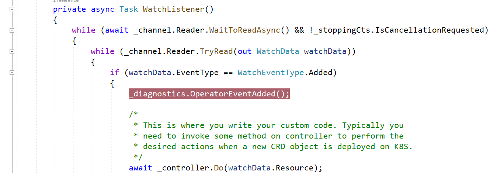

# Getting started

*Lucecu* is a DotNet template for creating a default scaffolding for Kubernetes K8S operators on DotNet/C#.

> You can check more information about Kubernetes operators on the [Oficial Documentation](https://kubernetes.io/docs/concepts/extend-kubernetes/operator/).

## Install template

TODO

## Create a new project

Once the template is installed you can create new  projects for Kubernetes Operators using this template.

```shell
dotnet new k8soperator --name HealthChecksOperator --crd-name healthcheck --crd-short-name hc
```

Where

- name: Is the name of the project to be created.
- crd-name: Is the name, lowercase, of the new Kubernetes CRD.
- crd-short-name: Is the short name, lowercase, of the new Kubernetes CRD ( like svc is the short name for services).

## Installing CRD

The new project include a *Deployment* folder with the new CRD deployment manifest, like this:

```yaml
apiVersion: apiextensions.k8s.io/v1beta1
kind: CustomResourceDefinition
metadata:
  name: healthchecks.xabaril.io
spec:
  group: xabaril.io
  names:
    plural: healthchecks
    singular: healthcheck
    kind: healthcheck
    listKind: healthchecks
    shortNames:
      - hc
  versions:
    - name: v1
      served: true
      storage: true
  scope: Namespaced
  validation:
    openAPIV3Schema:
      properties:
        spec:
          properties:
            someproperty:
              type: string
          required:
            - someproperty
```

By default, the new CRD include a property with name **someproperty** of type string, but you can add here new properties, and modify the generated class [CRDName]ResourceSpec.cs to add also your new properties.

To create this new CRD on Kubernetes, execute the following command:

```shell
> kubectl apply -f ./HealthCheck_crd_definition.yaml
```
If the command is working well the output will be some like:

```shell
customresourcedefinition.apiextensions.k8s.io/healthchecks.xabaril.io created
```
To test if Kubernetes understand the new CRD execute some of the next commands:

```shell
> kubectl get healthchecks
```
```shell
> kubectl get healthcheck
```
```shell
> kubectl get hc
```

## Debuging CRD

You can debug the Kubernetes operator like a regular project,  the Kubernetes client use the cluster config or user config depending on the operator is executed.

```csharp
services.AddSingleton<IKubernetes>(sp =>
{
    var config = KubernetesClientConfiguration.IsInCluster() 
    ? KubernetesClientConfiguration.InClusterConfig() 
    : KubernetesClientConfiguration.BuildConfigFromConfigFile();

    return new Kubernetes(config);
});
```

Once the project is on debugging add a new break point on the method *OnEventHandlerAsync* inside the operator class, HealthChecksOperator.cs. NO use the file 'create_new_healthcheck.yaml' to deploy a new CRD object and the break point will be active.



## Deploy Operator

TODO

## Delete CRD

To delete created CRD get the name and delete it:

```shell
❯ kubectl get crds
NAME                                    CREATED AT
healthchecks.xabaril.io                 2020-04-10T15:34:54Z
```

```shell
❯ kubectl delete crd healthchecks.xabaril.io
customresourcedefinition.apiextensions.k8s.io "healthchecks.xabaril.io" deleted
```